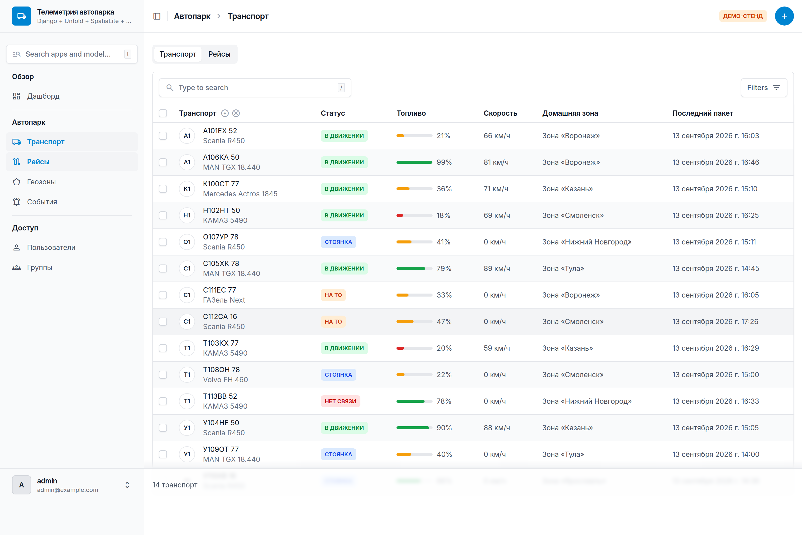
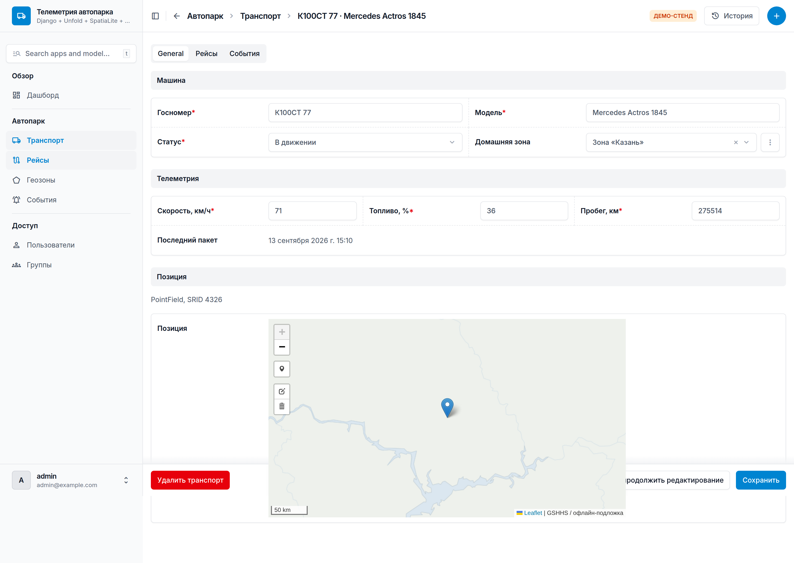
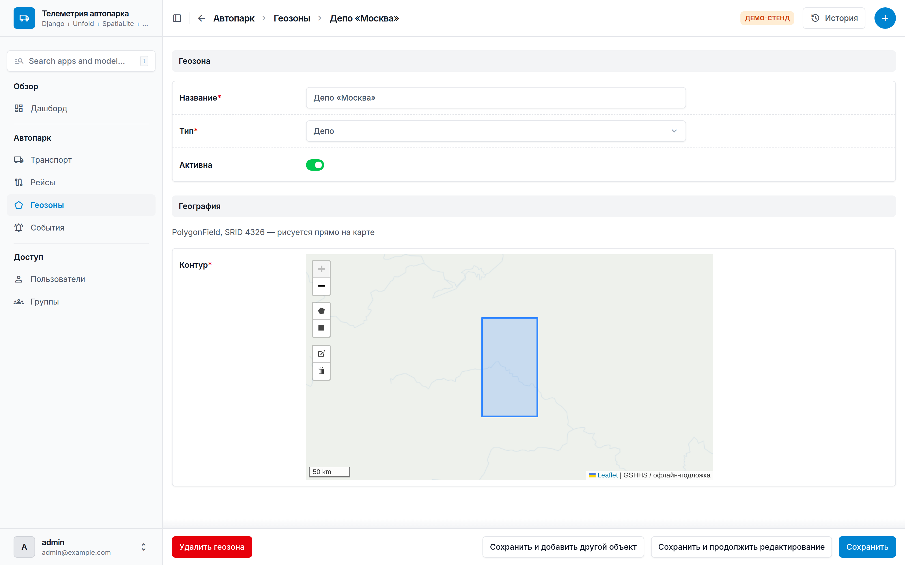
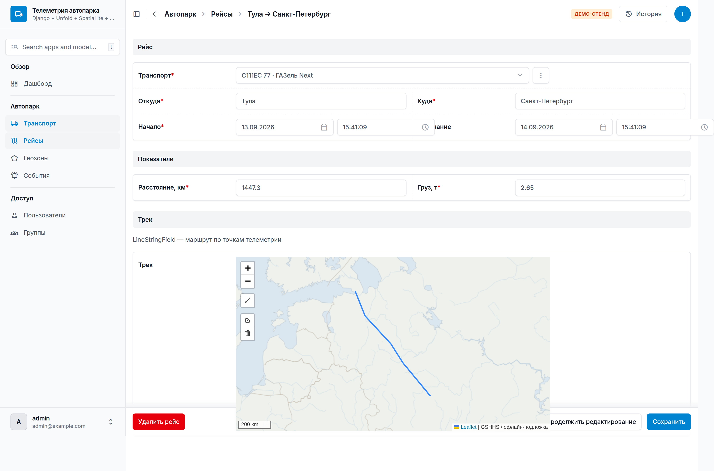
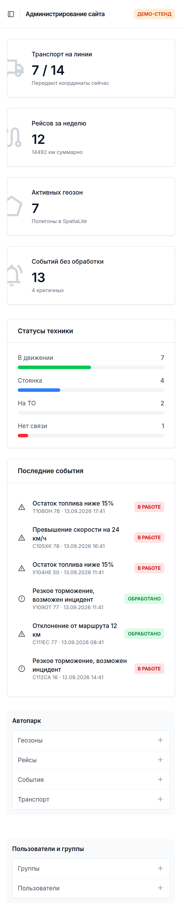

# Телеметрия автопарка — демо админки

Рабочий стенд на связке **Django 5.2 + Unfold + SQLite/SpatiaLite + GDAL/GEOS**.
Показывает, как выглядит и работает админка с геоданными: полигоны геозон,
точки машин, треки рейсов — всё в одной SQLite-базе, редактируется прямо на карте.

## Скриншоты

| | |
|---|---|
|  |  |
| Дашборд: KPI-карточки, статусы, лента событий | Список: бейджи статусов, прогресс-бары, фильтры |
|  |  |
| Карточка: вкладки, инлайны рейсов и событий, PointField | Геозона: PolygonField рисуется мышью |
|  |  |
| Рейс: LineStringField, длина считается GEOS | Адаптивная вёрстка |

Тёмная тема — те же файлы с суффиксом `-dark`.

## Стек

| Слой | Что используется |
|---|---|
| Фреймворк | Django 5.2, `django.contrib.gis` |
| Админка | `django-unfold` (Tailwind-тема поверх стандартной админки) |
| БД | SQLite + расширение `mod_spatialite` (SpatiaLite 5.1) |
| Гео-библиотеки | GDAL 3.8, GEOS, PROJ — берутся из системы |
| Карта в формах | `django-leaflet` (Leaflet + Leaflet.draw, ассеты локальные) |

## Запуск

```bash
# системные библиотеки (Ubuntu/Debian)
sudo apt-get install -y libsqlite3-mod-spatialite gdal-bin libgdal-dev binutils libproj-dev libgeos-dev

python -m venv .venv && source .venv/bin/activate
pip install -r requirements.txt

python manage.py migrate
python manage.py seed          # демо-данные + суперпользователь admin / admin12345
python manage.py runserver
```

Админка: http://127.0.0.1:8000/admin/

## Что внутри

```
config/settings.py   настройки: spatialite-движок, UNFOLD (сайдбар, цвета, дашборд), LEAFLET_CONFIG
fleet/models.py      Zone (PolygonField), Vehicle (PointField), Trip (LineStringField), Alert
fleet/admin.py       Unfold ModelAdmin + LeafletGeoAdminMixin, бейджи, фильтры, дашборд-callback
templates/admin/index.html   кастомный дашборд на компонентах Unfold
fleet/management/commands/seed.py   генератор демо-данных
tools/make_tiles.py  офлайн-тайлы подложки (см. ниже)
tools/shots.py       скриншоты админки через Playwright
```

Геометрия считается на стороне GEOS/GDAL, а не в Python:

```python
# площадь геозоны в км² — перепроекция 4326 → 3857 средствами GDAL
self.area.transform(3857, clone=True).area / 1_000_000

# длина трека рейса
track.transform(3857, clone=True).length / 1000
```

## Про подложку карты

Стенд собирался в песочнице без доступа к `tile.openstreetmap.org`, поэтому
подложка сгенерирована офлайн из береговых линий GSHHS (`tools/make_tiles.py`)
и лежит в `static/tiles/` (в git не коммитится — генерируется командой
`python tools/make_tiles.py 7`).

В обычном окружении вместо неё ставится обычный OSM-слой в `config/settings.py`:

```python
LEAFLET_CONFIG = {
    "TILES": [("OSM", "https://tile.openstreetmap.org/{z}/{x}/{y}.png",
               {"attribution": "© OpenStreetMap"})],
}
```

## Замечания по связке

- **SpatiaLite тянет почти весь PostGIS-функционал**: индексы, `transform()`,
  предикаты (`contains`, `intersects`, `dwithin`). Чего нет — оконных гео-агрегатов
  и части растровых операций; при росте нагрузки переезд на PostGIS — смена одной строки `ENGINE`.
- **Unfold не имеет своего гео-виджета**: GIS-поля рисует либо стандартный
  OpenLayers-виджет Django, либо `django-leaflet` (взят здесь — ассеты локальные, есть Leaflet.draw).
  Подключается миксином: `class VehicleAdmin(LeafletGeoAdminMixin, unfold.admin.ModelAdmin)`.
- **Интерфейс Unfold переведён не полностью** — часть строк («Type to search», «Filters»)
  остаётся на английском, переводится через собственный `.po`.
