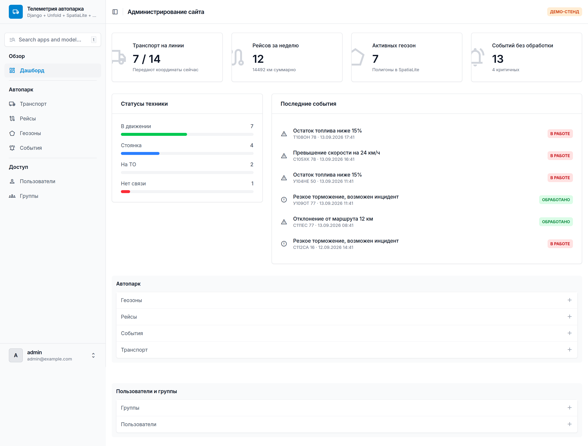

# Dashboard

Django-проект с админкой на [Unfold](https://unfoldadmin.com/). Стартовый каркас:
настроенная тема, кастомный дашборд, оформленные пользователи и группы.
Доменных моделей пока нет — они добавляются в приложение `core`.



Светлая и тёмная темы (Unfold переключает их сам), адаптив до 420 px —
остальные экраны в [docs/screenshots](docs/screenshots).

## Стек

| | |
|---|---|
| Django | 5.2 |
| django-unfold | 0.91 |
| БД | SQLite (файл `db.sqlite3`) |

Никаких системных зависимостей: `pip install -r requirements.txt` и всё работает.

## Запуск

```bash
python -m venv .venv && source .venv/bin/activate
pip install -r requirements.txt

python manage.py migrate
python manage.py createsuperuser
python manage.py runserver
```

Админка: http://127.0.0.1:8000/admin/

## Структура

```
config/settings.py   настройки проекта и словарь UNFOLD (сайдбар, цвета, дашборд)
config/urls.py       / → редирект на /admin/
core/admin.py        dashboard_callback, оформленные UserAdmin и GroupAdmin
core/models.py       место для доменных моделей
templates/admin/index.html   дашборд на компонентах Unfold
core/tests.py        тесты дашборда и доступа к админке
tools/shots.py       скриншоты админки (dev, см. requirements-dev.txt)
```

## Как это настроено

**Unfold идёт первым в `INSTALLED_APPS`** — до `django.contrib.admin`, иначе его шаблоны не подхватятся.

**Своя админ-модель наследует два класса:**

```python
from unfold.admin import ModelAdmin

@admin.register(Article)
class ArticleAdmin(ModelAdmin):
    ...
```

Для моделей, у которых уже есть готовый ModelAdmin (User, Group), миксуются оба —
см. `core/admin.py`.

**Дашборд** рисуется из `templates/admin/index.html`, данные приходят из
`core.admin.dashboard_callback` (указан в `UNFOLD["DASHBOARD_CALLBACK"]`).
Сейчас показывает метрики по пользователям; доменные метрики добавляются туда же.

**Сайдбар** задаётся вручную в `UNFOLD["SIDEBAR"]["navigation"]` — новые разделы
нужно дописывать туда, автоматически они не появляются.

## CI

GitHub Actions (`.github/workflows/ci.yml`) на каждый push в `main` и на каждый PR:

| Job | Что делает |
|---|---|
| Линтер | `ruff check` + `ruff format --check` |
| Тесты | `manage.py check`, проверка несозданных миграций, `manage.py test`, `collectstatic` на Python 3.11 / 3.12 / 3.13 |

Локально то же самое:

```bash
pip install -r requirements-dev.txt
ruff check . && ruff format --check .
python manage.py test
```

## Настройки окружения

| Переменная | По умолчанию |
|---|---|
| `DJANGO_SECRET_KEY` | небезопасный ключ для разработки |
| `DJANGO_DEBUG` | `1` |
| `DJANGO_ALLOWED_HOSTS` | `*` |

Перед деплоем задать все три.

## Что дальше

- Доменные модели в `core` (или отдельными приложениями) + их `ModelAdmin`.
- Русская локаль для Unfold: часть строк интерфейса («Type to search», «Filters»)
  остаётся английской, лечится собственным `.po`-файлом.
- Гео-слой (SpatiaLite + GDAL + карты в формах) — рабочий вариант лежит в истории
  ветки, коммит `d5efad7`: `git show d5efad7 --stat`.
